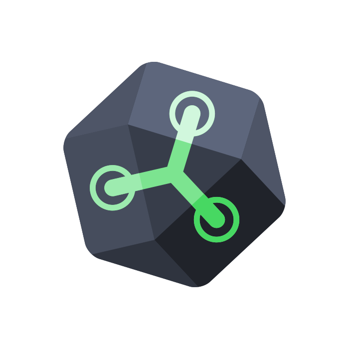

# Hello there! Thank you for visiting my profile!👋

## About me

I'm Spyros Baltsas, a self taught developer, with expertise on back-end. I live in Thessaloniki, Greece. Currently studying (5th year) Electrical and Computer Engineering at Aristotle University of Thessaloniki. I love everything about computers, from software to hardware. I started learning how to code on 2016 and I'm always down for interesting projects! The main OS I use is linux and especially Debian distribution, since I support open-source and I am deeply concerned about privacy. I am also interested in linux server security and administration, so self host several apps and services as well, which some of them are available to public. My favorite text editors are Emacs and Visual Studio Code. I always enjoy learning something new! My hobbies, besides doing projects and managing servers, are gaming and listening to music :)
  

### GitHub stats

### Profile visitor counter (hosted by me!)

## 🛠️ Programming languages and technologies I use

### Back-end:
 

    
Programming and Database Query Languages

     
    <table>
        <tr valign="top">
                <td width="80px" align="center">
                <strong>Python</strong> 
                
                </td>
                <td width="80px" align="center">
                <strong>Java</strong> 
                
                </td>
                <td width="80px" align="center">
                <strong>C / C++</strong> 
                
                </td>
                <td width="80px" align="center">
                <strong>C#</strong> 
                
                </td>
        </tr>
        <tr valign="top">
                <td width="80px" align="center">
                <strong>Bash</strong> 
                
                </td>
                <td width="80px" align="center">
                <strong>SQL</strong> 
                
                </td>
                <td width="80px" align="center">
                <strong>JavaScript</strong> 
                
                </td>
                <td width="80px" align="center">
                <strong>Flux</strong> 
                
                </td>
        </tr>
    </table>
    
 

 

    
Technologies / Frameworks

     
    <table>
        <tr align="vtop">
            <td width="80px" align="center">
                <strong>Android Studio</strong> 
                
            </td>
            <td width="80px" align="center">
                <strong>QT</strong> 
                
            </td>
            <td width="80px" align="center">
                <strong>WxWidgets</strong> 
                
            </td>
        </tr>
        <tr>
            <td width="100px" align="center">
                <strong>InfluxDB</strong> 
                
            </td>
            <td width="100px" align="center">
                <strong>NodeJS</strong> 
                
            </td>
            <td width="100px" align="center">
                <strong>Flask</strong> 
                
            </td>
        </tr>
    </table>
 

 

### Front-end web development:
 <table>
    <tr align="vtop">
        <td width="80px" align="center">
                <strong>HTML</strong> 
                
        </td>
        <td width="80px" align="center">
                <strong>CSS</strong> 
                
        </td>
    </tr>
 </table>
 

### Version control:
 - Git (GitHub and GitLab)
 - Mercurial

### Text editors and IDEs that I use:
 - Visual Studio Code
 - Visual Studio
 - Eclipse
 - Android Studio
 - PyCharm
 - IntelliJ
 - Emacs (mainly for document writing)

 

## 🤙 Hit me on
<table>
    <tr>
        <td align="center">
            
        </td>
        <td align="center">
            
        </td>
        <td align="center">
            
        </td>
        <td align="center">
            <a href="mailto:sbaltsas@yahoo.gr">sbaltsas@yahoo.gr</a>
        </td>
    </tr>
</table>
